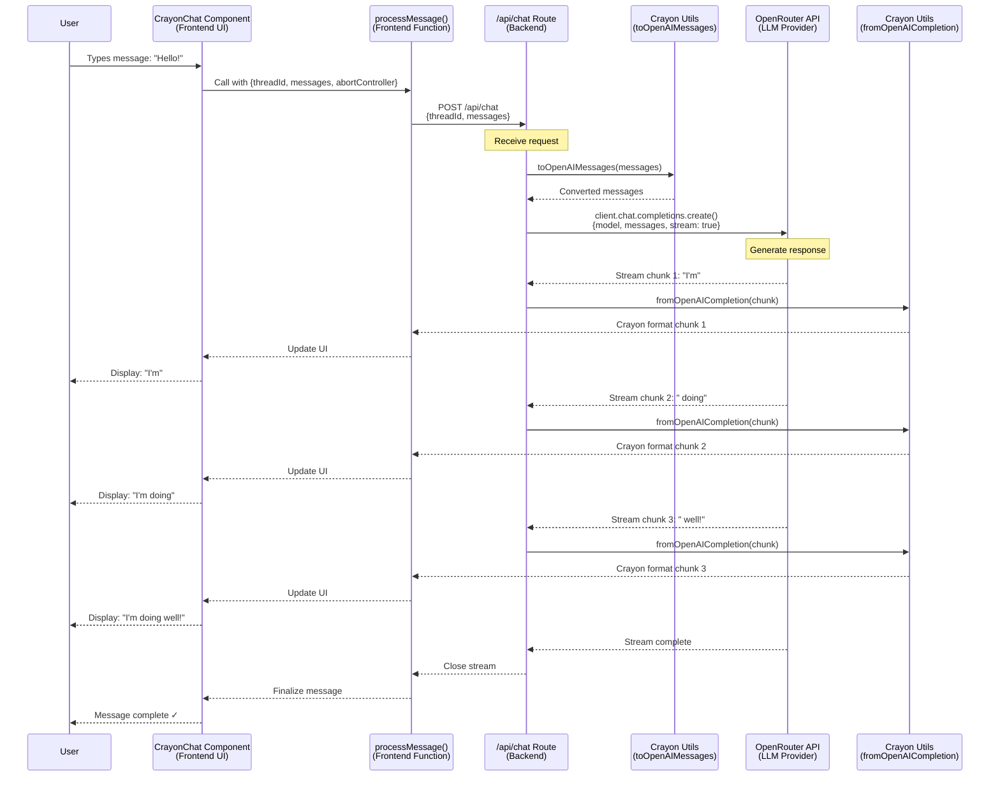
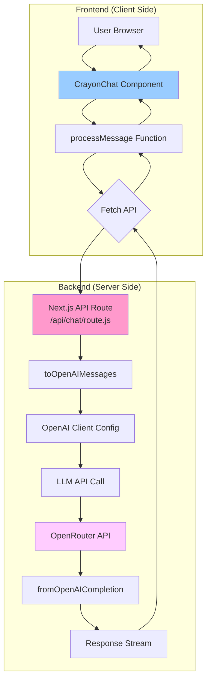
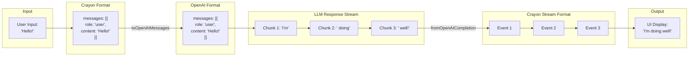
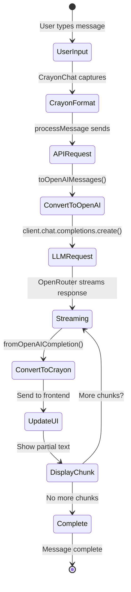

# Crayon Architecture - Mermaid Diagrams

## 1. Complete Flow Diagram (Sequence)



## 2. Component Architecture



## 3. Data Transformation Flow



## 4. System Architecture with Environment Config

```mermaid
graph TD
    subgraph "Environment Variables"
        ENV1[OPENROUTER_API_KEY]
        ENV2[OPENROUTER_API_BASE]
        ENV3[OPENROUTER_SITE_URL]
        ENV4[OPENROUTER_MODEL]
    end
    
    subgraph "Application Layer"
        APP[Next.js App]
        UI[CrayonChat UI]
        PROCESS[processMessage]
    end
    
    subgraph "API Layer"
        ROUTE[/api/chat Route]
        CLIENT[OpenAI Client]
    end
    
    subgraph "Crayon Utils"
        TO[toOpenAIMessages]
        FROM[fromOpenAICompletion]
        FORMAT[templatesToResponseFormat]
    end
    
    subgraph "External Services"
        OR[OpenRouter API]
        LLM[LLM Model]
    end
    
    ENV1 --> CLIENT
    ENV2 --> CLIENT
    ENV3 --> CLIENT
    ENV4 --> CLIENT
    
    UI --> PROCESS
    PROCESS --> ROUTE
    ROUTE --> TO
    ROUTE --> FORMAT
    ROUTE --> CLIENT
    
    CLIENT --> OR
    OR --> LLM
    LLM --> OR
    OR --> FROM
    FROM --> ROUTE
    ROUTE --> PROCESS
    PROCESS --> UI
    
    style ENV1 fill:#ffe6e6
    style ENV2 fill:#ffe6e6
    style ENV3 fill:#ffe6e6
    style ENV4 fill:#ffe6e6
    style UI fill:#e6f3ff
    style OR fill:#f0e6ff
```

## 5. Message Lifecycle



## Key Components Explained

### Frontend Components:
- **CrayonChat**: Pre-built UI component from `@crayonai/react-ui`
- **processMessage**: Custom function that bridges UI and API

### Backend Components:
- **API Route**: Next.js server endpoint (`/api/chat/route.js`)
- **OpenAI Client**: Configured for OpenRouter
- **Crayon Utils**: 
  - `toOpenAIMessages`: Format converter (Crayon → OpenAI)
  - `fromOpenAICompletion`: Stream converter (OpenAI → Crayon)
  - `templatesToResponseFormat`: Response structure config

### External Services:
- **OpenRouter**: LLM provider proxy
- **LLM Model**: Actual AI model (e.g., `kwaipilot/kat-coder-pro:free`)

These diagrams show the complete flow of how Crayon orchestrates the chat experience!